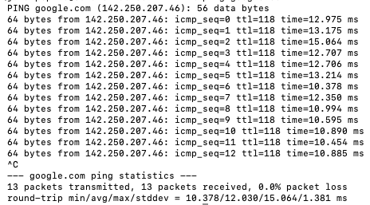
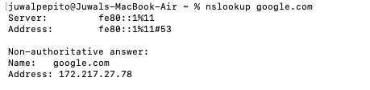
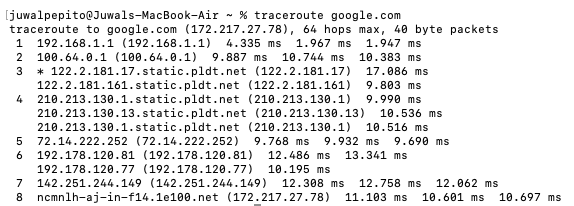
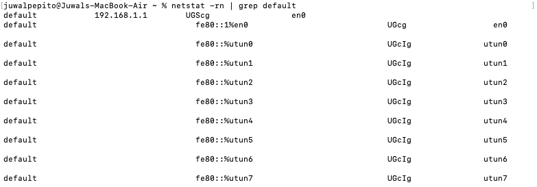
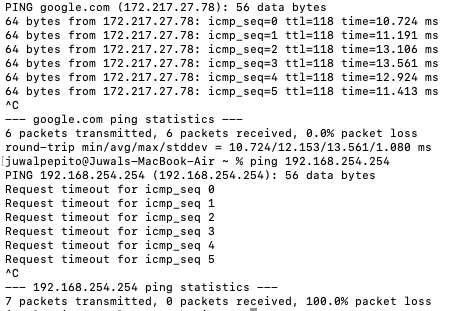

# Network Troubleshooting Lab

## Overview

This project demonstrates basic network troubleshooting techniques using macOS Terminal. The objective was to diagnose connectivity, DNS, and routing issues using common networking tools and document the troubleshooting process.

## Objectives

- Verify internet connectivity
- Test DNS resolution
- Identify the default gateway
- Analyze network routes
- Compare successful and failed connectivity tests
- Practice troubleshooting methodologies used in IT Support environments

## Tools Used

- macOS Terminal
- Ping
- NSLookup
- Traceroute
- Netstat
- GitHub

---

## Scenario 1: Internet Connectivity Test

### Problem

Verify whether the device can communicate with an external host on the internet.

### Command Used

```bash
ping google.com
```

### Findings

- Successfully reached Google's servers.
- DNS resolution was successful.
- 0% packet loss was observed.
- Average latency was approximately 12 ms.
- Internet connectivity was confirmed.

### Screenshot



---

## Scenario 2: DNS Resolution Test

### Problem

Verify that a domain name can be translated into an IP address.

### Command Used

```bash
nslookup google.com
```

### Findings

- Successfully resolved google.com to a public IP address.
- Confirmed that DNS services were functioning properly.
- Demonstrated how domain names are translated into IP addresses.

### Screenshot



---

## Scenario 3: Route Analysis

### Problem

Identify the network path used to reach an external destination.

### Command Used

```bash
traceroute google.com
```

### Findings

- Observed multiple network hops between the local device and destination.
- Demonstrated how traffic traverses network devices to reach an external host.
- Useful for identifying routing issues and network delays.

### Screenshot



---

## Scenario 4: DNS Failure Simulation

### Problem

Observe how DNS resolution failures appear during troubleshooting.

### Command Used

```bash
nslookup google123456.com
```

### Findings

- The domain name could not be resolved.
- Demonstrated a DNS-related failure scenario.
- Highlighted the difference between DNS issues and internet connectivity issues.

### Screenshot


---

## Scenario 5: Default Gateway Identification

### Problem

Identify the router responsible for forwarding outbound network traffic.

### Command Used

```bash
netstat -rn | grep default
```

### Findings

- Identified the default gateway used for outbound communication.
- Verified the active network route.
- Demonstrated basic routing table analysis.

### Screenshot



---

## Scenario 6: Successful vs Failed Connectivity Test

### Problem

Compare the results of successful and unsuccessful connectivity tests.

### Commands Used

```bash
ping google.com
```

```bash
ping 192.168.254.254
```

### Findings

- Successful connectivity test returned responses from the destination host.
- Failed connectivity test resulted in 100% packet loss.
- Demonstrated how network failures appear during troubleshooting.

### Screenshot



---

## Skills Practiced

- Network Troubleshooting
- TCP/IP Fundamentals
- DNS Resolution
- Connectivity Testing
- Routing Concepts
- Command-Line Operations
- Technical Documentation
- Problem Solving

---

## Key Takeaways

This lab provided hands-on experience troubleshooting common network issues using industry-standard command-line tools. The project strengthened my understanding of connectivity testing, DNS resolution, routing, and troubleshooting methodologies commonly used in IT Support environments.

---

## Project Structure

```
network-troubleshooting-lab/
│
├── README.md
└── screenshots/
    ├── screenshot-01-ping-google.png
    ├── screenshot-02-nslookup.png
    ├── screenshot-03-traceroute.png
    ├── screenshot-04-dns-failure.png
    ├── screenshot-05-default-gateway.png
    └── screenshot-06-connectivity-comparison.png
```
